## Instalar Ubuntu 24.04

**Download Ubuntu:** https://ubuntu.com/download/server

A navegação pelas telas de configuração é realizada por meio das **setas direcionais do teclado**, com a confirmação das opções feita pela tecla **Enter**.
### Boot e Instalação do Ubuntu Server

Ao realizar o boot utilizando a imagem **(.iso)** ou um **pendrive**, a tela do GNU GRUB será exibida.
Para iniciar o processo de instalação, selecione a opção **“Try or Install Ubuntu Server”**.

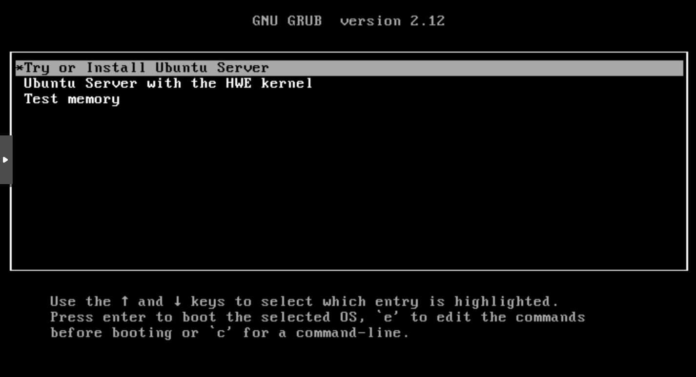

**Sobre o HWE Kernel:**
O HWE Kernel (Hardware Enablement) no Ubuntu Server disponibiliza um kernel mais recente para versões LTS, ampliando o suporte a hardware moderno. Sua utilização deve ser avaliada de acordo com as necessidades de compatibilidade e estabilidade do ambiente.

**Mais informações:** [HWE Kernel](https://canonical-kernel-docs.readthedocs-hosted.com/latest/reference/hwe-kernels/)

---
### Idioma

Selecione o **idioma** desejado. 

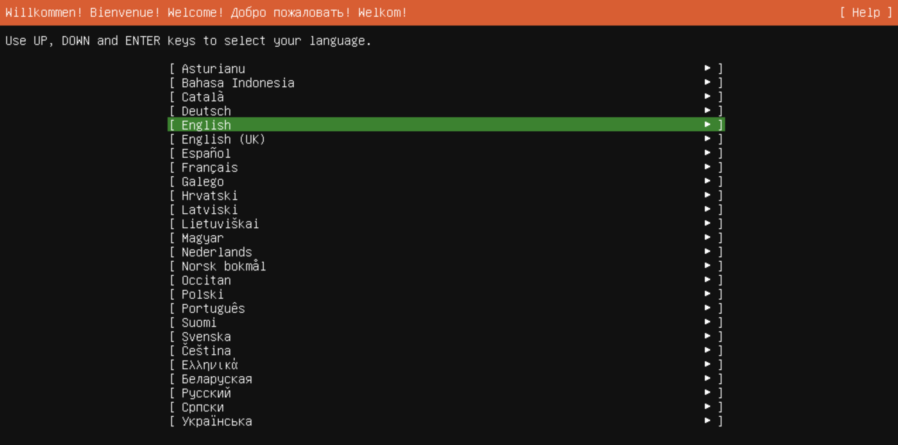

---
### Layout do teclado

Selecione o **layout** e **variant** do teclado.

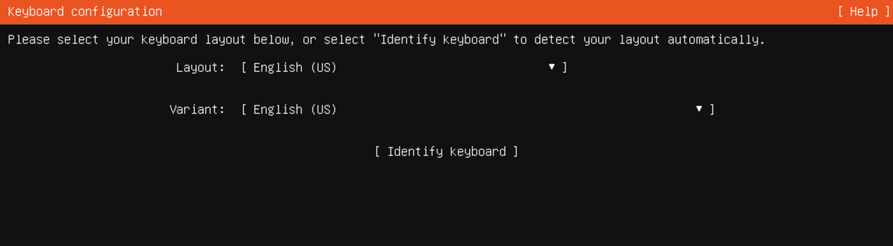

---

### Tipo de Instalação

Selecione o tipo de instalação desejado:

- **Ubuntu Server:** Instalação padrão do Ubuntu Server, incluindo um conjunto de pacotes recomendados.
  
- **Ubuntu Server (Mínimo):** Versão enxuta, contendo apenas os recursos essenciais para o funcionamento do sistema e componentes adicionais básicos.

**Opcional:**
**Search for third-party drivers:** Durante o processo de instalação, o sistema realizará a verificação do hardware e, caso existam drivers de terceiros disponíveis, eles serão apresentados para seleção e instalação no ambiente.

---

### Rede - IPV4 Fixo

Por padrão, a interface de rede está configurada para obter o endereço IP automaticamente. Nesse modo, o IP pode ser alterado conforme as configurações do servidor DHCP.  
Recomendamos, portanto, alocar um IP fixo para o servidor diretamente no DHCP e/ou configurar manualmente o IP no sistema operacional.

#### Configuração do Adaptador de Rede 

Nesta etapa da instalação do **Ubuntu Server**, é possível configurar **IPv4**, **IPv6** e **VLAN**, incluindo a **definição de um endereço IP fixo para o sistema**.

#### Configurando o IPv4

Selecione a interface de rede desejada e, em seguida, escolha Edit IPv4.

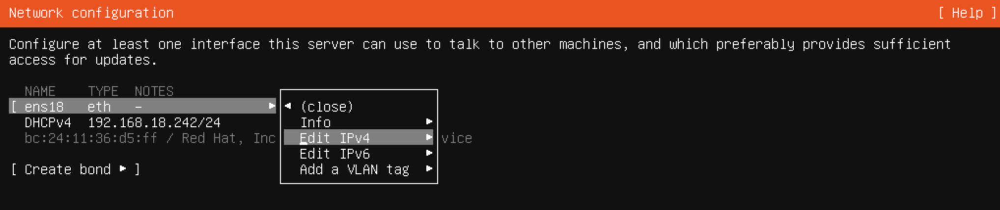
#### Metodo IPv4

Em Configuração IPv4, escolha a opção **_Manual_**.

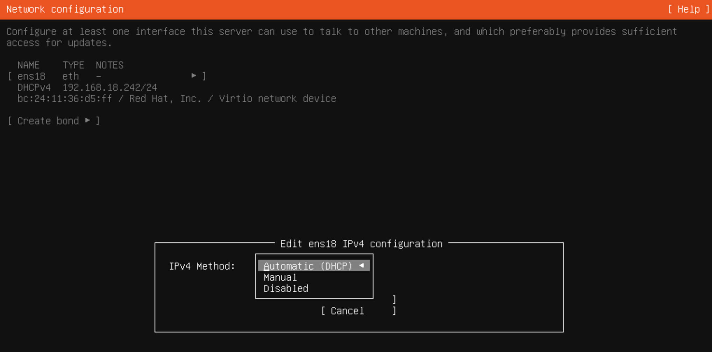
#### Configurando IPV4 Fixo

Após selecionar **IPv4 Method: Manual**, é necessário definir as seguintes informações:
- **Subnet:** Define a sub-rede à qual o endereço IP pertence.
  **Exemplo:** 255.255.255.0
- **Address:** Endereço IP atribuído ao dispositivo dentro da sub-rede.
  **Exemplo:** 192.168.1.10
- **Gateway:** Endereço IP do roteador que permite a comunicação com outras redes.
  **Exemplo:** 192.168.1.1
- **Name Server:** Servidor DNS responsável por resolver nomes de domínio em endereços IP.
  **Exemplo:** 8.8.8.8

Após definir as configurações, clique em **Save** para aplicar e salvar as alterações.

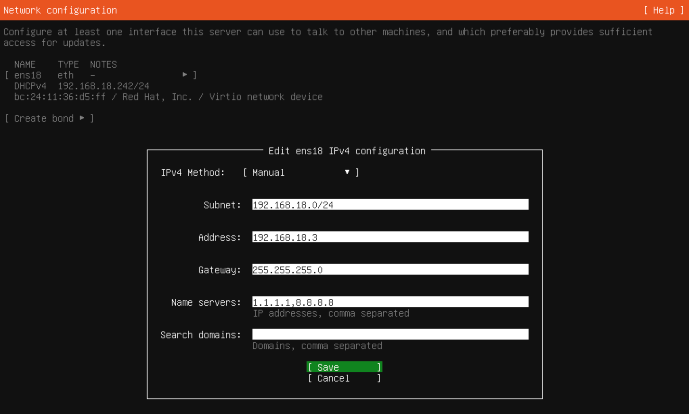
#### Static IPV4

Após salvar, a tela Network Configuration exibirá as seguintes informações:
- Nome do adaptador
- Método IPv4 definido como: Static
- Endereço IP estático configurado

Após checar as configurações, clique em **Done** para continuar.

#### Proxy

Nesta etapa de configuração, é possível definir um **proxy**, caso seja necessário no seu ambiente.  
Caso contrário, deixe os campos em branco e prossiga.

Após verificar as configurações, clique em **Done** para continuar.

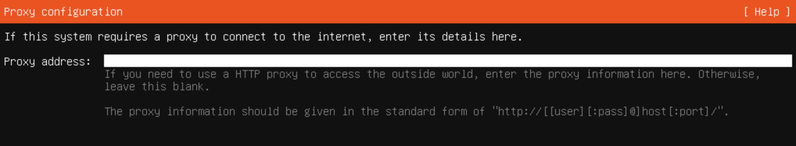
### Repositório de instalação

Nesta etapa, é realizada a configuração do **Servidor de Espelhamento (Mirror)** do Ubuntu.  
Você pode manter o endereço padrão do mirror (no exemplo, o mirror oficial do Brasil) e clicar em **Done** para continuar.

O instalador testará a conexão com o mirror e, se estiver tudo correto, seguirá com a instalação normalmente.

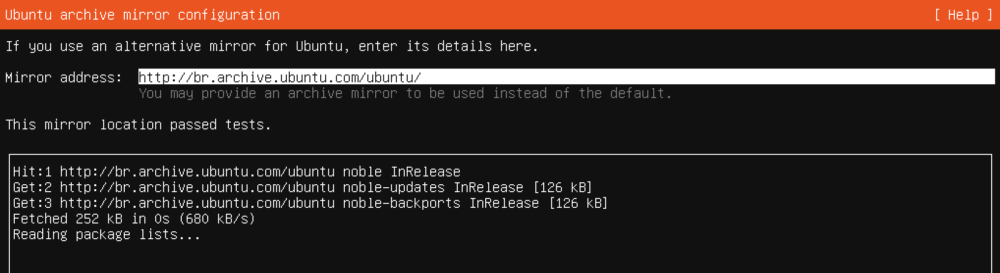
### Configuração de armazenamento:

Nesta etapa, siga o padrão apresentado na tela. Essas opções atendem a maioria dos usuários.
- **Use an entire disk**: utiliza todo o disco para o Ubuntu, apagando dados existentes.  
- **Set up this disk as an LVM group**: permite gerenciar e expandir o espaço em disco com mais facilidade no futuro.  
- **Encrypt the LVM group with LUKS**: criptografa os dados do disco usando uma senha.  
- **Create a recovery key**: gera uma chave de recuperação da criptografia.  
- **Custom storage layout**: permite configurar partições manualmente (opção avançada).

Caso deseje alterar essas configurações, utilize a opção **Help** para acessar a documentação oficial do Ubuntu.

Clique em **Done** para continuar.

#### Confirmação de armazenamento:

Nesta etapa, serão apresentadas as **configurações padrão de armazenamento**. Essas opções atendem à maioria dos usuários.

Caso deseje alterar essas configurações, utilize a opção **Help** para acessar a documentação oficial do Ubuntu.

Clique em **Done** para continuar.

#### Confirmação de formatação: 

Nesta etapa, será apresentada a janela para confirmar a **formatação da unidade de disco** e dar continuidade ao processo de **instalação**.

Clique em **Continue** para prosseguir.

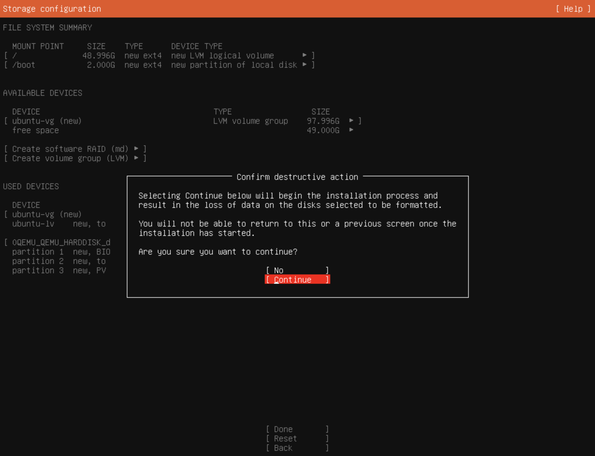
### Configuração de usuario

Nesta etapa, iremos configurar o **usuário do sistema**.  
Preencha as informações solicitadas e clique em **Done** para prosseguir.

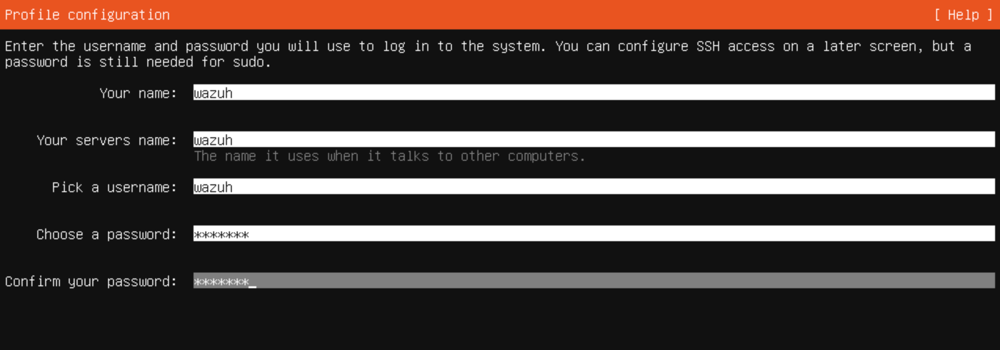
### Ubuntu Pro

Nesta etapa, siga o padrão apresentado na tela. Essas opções atendem à maioria dos usuários.

**Obs.:** O **Ubuntu Pro** pode ser habilitado caso você possua um licenciamento ativo.

Caso deseje alterar essas configurações, utilize a opção **Help** para acessar a documentação oficial do Ubuntu..

Clique em **Done** para continuar.

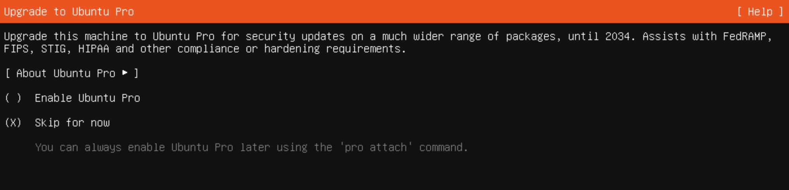
### SSH

Nesta etapa, siga o padrão apresentado. Iremos instalar o **OpenSSH Server** para que seja possível acessar o servidor via **SSH**. Essas opções atendem à maioria dos usuários.

Caso deseje alterar essas configurações, utilize a opção **Help** para acessar a documentação oficial do Ubuntu.

Clique em **Done** para continuar.

### Drivers Terceiros

Nesta etapa, caso existam **drivers de terceiros disponíveis**, eles serão apresentados nesta janela para instalação durante o processo de **instalação do sistema operacional**.

Clique em **Continue** para prosseguir.

### Recursos adicionais

Nesta etapa, você pode selecionar **Snaps populares** para serem instalados durante o processo de **instalação do sistema operacional**.  
Caso deseje instalar algum Snap específico, basta selecioná-lo e continuar.

Caso deseje mais **informações**, utilize a opção **Help** para acessar a documentação oficial do Ubuntu.

Clique em **Done** para continuar.

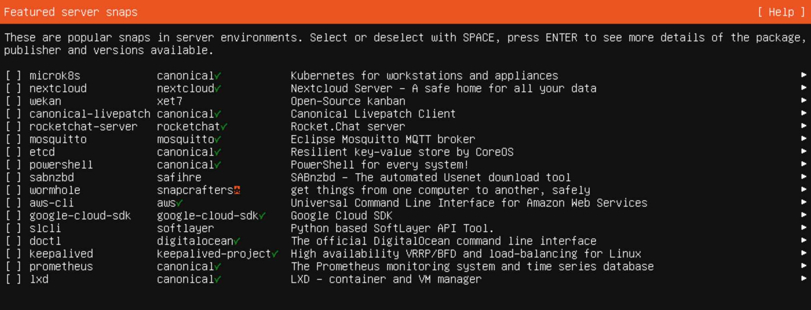

### Instalação do Sistema

Nesta etapa, será iniciada a **instalação do sistema**. Aguarde até a conclusão.

### Instalação concluida

Após o processo de instalação ser concluído, o sistema solicitará a reinicialização.

Clique em **Reboot Now.**

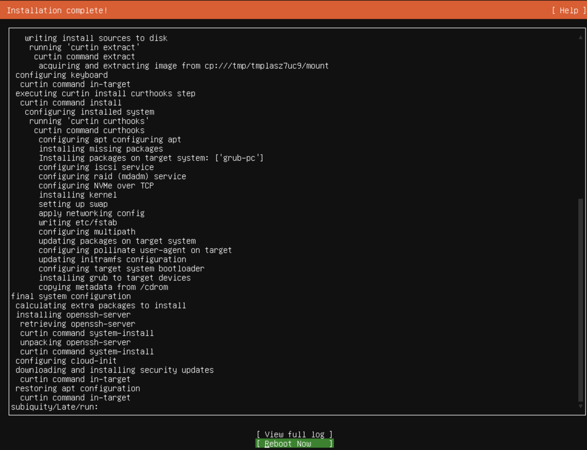
### Ubuntu Server

Após o reboot, o sistema será iniciado normalmente e estará pronto para uso.

### Help

[Ubuntu Pro](https://ubuntu.com/pro)
[Snaps](https://snapcraft.io/docs/snap-tutorials)
[Configuração de Armazenamento](https://canonical-subiquity.readthedocs-hosted.com/en/latest/howto/configure-storage.html#configure-storage)
